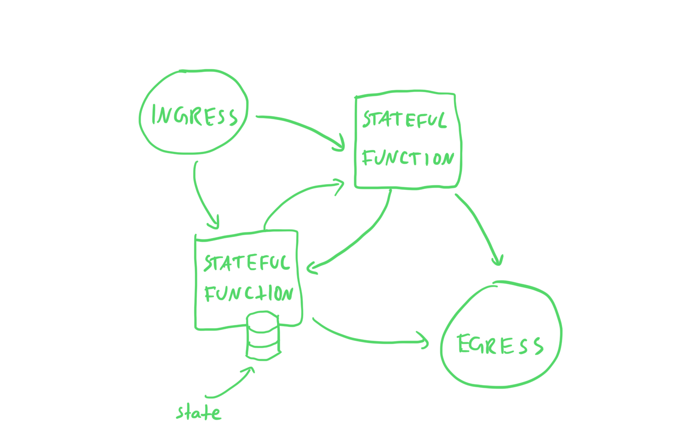
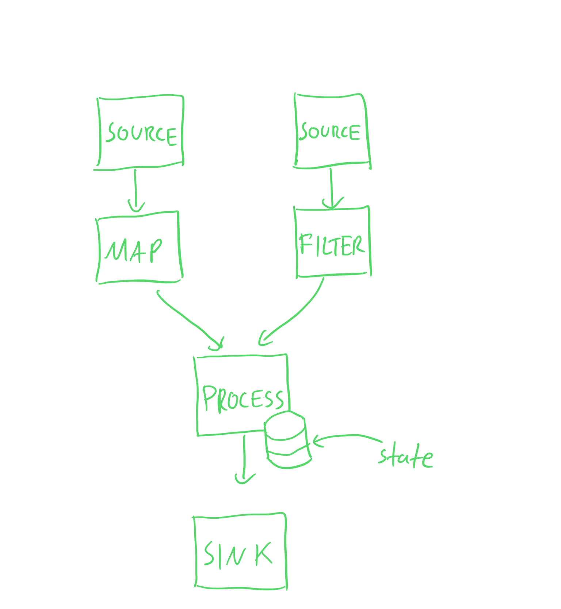
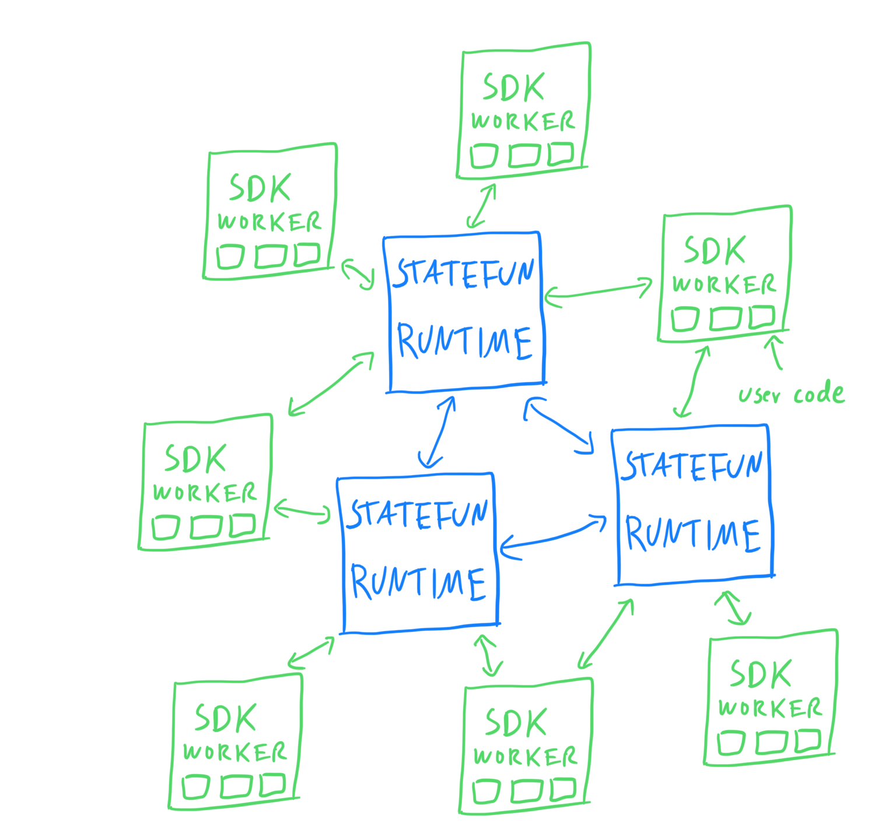

## Introducing the Rust SDK for Apache Flink Stateful Functions

Some time ago we did a three day hackathon at
[Ververica](https://ververica.com). I choose to develop a new SDK for [Apache
Flink Stateful Functions
(Statefun)](https://flink.apache.org/stateful-functions.html) in Rust because
a) I wanted to get to know this somewhat recent addition of Apache Flink, and
b) I was looking for an excuse to write more Rust code. There is an
intersection of reasons that make this interesting:

 - an SDK will potentially be useful to people
 - I wanted to get more familiar with Rust and having a real-world project is
   more useful for this than some toy exercise
 - it's separate enough from Flink to feel fresh but still in the Flink
   ecosystem
 - this will allow me to setup a "neat" new project with proper CI integration,
   all the fancy build tooling, automatic formatting, etc.

The Rust SDK is available as a [Github
Project](https://github.com/aljoscha/statefun-rust) but it might be best to
first read this post to get an overview of the different components before
diving in.

### What is Apache Flink Stateful Functions?

Statefun is a new API for writing event-driven applications on top of Apache
Flink. The programming model consists of _Stateful Functions_ that can send
messages amongst themselves and update their state based on incoming messages.
messages (or events) can come into the system through an _Ingress_ while
messages can be sent to the outside world via an _Egress_.

This is different from the existing Flink SDKs, the Table API/SQL, and the
DataStream/DataSet API. When using the Table API, users specify relational
queries, that Flink then turns into a dataflow graph for execution. When using
the DataStream or DataSet API users specify a directed acyclic graph (DAG) of
operations that describes how data should be processed from sources through
operations to sinks. The dataflow program is a static graph that describes how
data flows through the system. With the new Statefun API, stateful functions
are not tightly coupled but can instead send messages to arbitrary other
stateful functions, as long as they know the unique name of the function.

Concretely, when writing a Statefun program, you think about data ingress and
egress, writing stateful functions, how they react to incoming messages and
what messages they send to other stateful functions. Here's a figure that will
help visualize this:



Notice how messages can flow arbitrarily between all the stateful functions.

Conversely, when using the "traditional" Flink DataStream API you think about
how data flows from sources through various transformations to sinks. Here's a
visual representation of this model:



Contrast this to the above picture for Stateful Functions and note that data
only flows through the graph in one direction.

Please take a look at the
[walkthrough](https://ci.apache.org/projects/flink/flink-statefun-docs-master/getting-started/java_walkthrough.html)
in the documentation if if you want to learn more about the programming model
and how computation can be expressed with the Stateful Functions programming
model. Also, please take a look at this recent [blog
post](https://flink.apache.org/2020/08/19/statefun.html) about a real-world
Statefun use case.

### What's in a Statefun SDK?

As aspiring Statefun SDK developers, there are three things that we need to
consider: 1) the Statefun Runtime, 2) a Statefun SDK, and 3) the protocol these
two use to communicate. The first part already exists, the second part is what
we want to develop and the third one is what we need to know about when writing
our SDK.

Before we go into the details, it will be helpful to review how the different
parts of a Statefun Application are defined. We usually do this by providing
one or multiple module descriptors. In the case of a language SDK we need to
define a [remote
module](https://ci.apache.org/projects/flink/flink-statefun-docs-stable/sdk/modules.html#remote-module)
in a YAML file. We can use the
[module.yaml](https://github.com/aljoscha/statefun-rust/blob/main/statefun-greeter-example/module.yaml)
from the Greeter example to illustrate this. The module defines two functions:

```yaml
- function:
    meta:
        kind: http
        type: example/greeter
    spec:
        endpoint: http://rust-worker:5000/statefun
        states:
            - seen_count
        maxNumBatchRequests: 10
        timeout: 2min
- function:
    meta:
        kind: http
        type: example/relay
    spec:
        endpoint: http://rust-worker:5000/statefun
        maxNumBatchRequests: 10
        timeout: 2min
```

This tells the Statefun Runtime what functions there are and under which
protocol type and endpoint they can be reached.

A typical Statefun deployment will consist of several Runtime processes that
communicate with one or several SDK Worker processes. For us it is not
important where these processes run but they might run in Docker and/or on
different machines. It is the job of the Runtime to orchestrate the execution
of a Statefun program. The Runtime has to take care of routing messages between
different stateful functions and maintaining their state. When the Runtime
needs to process a message it will invoke a stateful function that is being
served by a SDK Worker process using a [Protobuf
Protocol](https://github.com/apache/flink-statefun/blob/master/statefun-flink/statefun-flink-core/src/main/protobuf/http-function.proto)
over HTTP.  This is where we as the SDK developer come in.

The SDK needs to provide two things:
 1. an API for writing stateful functions
 2. a means of registering stateful functions and serving them via the HTTP protocol

This figure shows the different components and how they interact:



It's important to note that the Runtime can be spread across multiple processes
and that we can also spawn multiple SDK Worker processes. The SDK Worker
processes never communicate with each other but only with the Runtime, while
the Runtime processes need to communicate with each other. If the stateful
functions are doing heavyweight computation it will also be beneficial to put
them behind a load balancer so that multiple SDK Workers can serve functions
behind a common endpoint.

### Introducing the Statefun Rust SDK


The SDK comes with an
[example](https://github.com/aljoscha/statefun-rust/tree/main/statefun-greeter-example)
that I will use to show the different parts of the SDK and how they fit
together.

The example comprises these parts:
 - a *module.yaml* that describes the different parts of the application
 - a data generator in *datagen.rs* that can send "random" messages to a Kafka
   topic and listens and prints message from a second Kafka topic
 - a *main.rs* that contains two stateful functions and the glue code that will
   start an HTTP endpoint for serving the stateful functions; this will
   serve as the SDK Worker process
 - a *Dockerfile* for both the data generator and the SDK Worker process
 - a *Dockerfile* for the Statefun Runtime that contains the *module.yaml*
 - a *docker-compose.yaml* that ties everything together and includes
   definitions for the Runtime processes, the SDK Worker, Kafka, and the data
   generator

You can check out the *module.yaml*, *Dockerfiles*, and *docker-compose.yaml*
at your leisure. Here, I will focus on the facilities the SDK provides for
writing stateful functions and serving them from a Worker process.

This is the code of the `greet()` stateful function:

```rust
pub fn greet(context: Context, request: GreetRequest) -> Effects {
    let seen_count: Option<Int32Value> = context.get_state("seen_count");

    let mut effects = Effects::new();

    let mut updated_seen_count = match seen_count {
        Some(count) => count,
        None => Int32Value::new(),
    };
    updated_seen_count.set_value(updated_seen_count.get_value() + 1);
    effects.update_state("seen_count", &updated_seen_count);

    let mut greet_response = GreetResponse::new();
    greet_response.set_name(request.get_name().to_owned());
    greet_response.set_greeting(format!(
        "Say hello to {} from Rust. I've seen them {} times now.",
        request.get_name(),
        updated_seen_count.get_value()
    ));

    effects.send(
        Address::new(FunctionType::new("example", "relay"), request.get_name()),
        greet_response,
    );

    effects
}
```

In this, we see all the relevant parts that we need to consider when writing a
stateful function with the Rust SDK. The signature of a function is always
`Fn(Context, I) -> Effects` where `I` is the input type,
[Context](https://docs.rs/statefun/0.1.1/statefun/struct.Context.html) is a
struct that allows the function to query information about the invocation
context and access state and
[Effects](https://docs.rs/statefun/0.1.1/statefun/struct.Effects.html) is a
struct that allows to effect changes, such as sending messages to other
functions or updating state.

This snippet shows all the functions that are available on `Context`:

```rust
impl<'a> Context<'a> {
    ...

    /// Returns the [Address](Address) of the stateful function that is being called. This is the
    /// statefun equivalent of `self`.
    pub fn self_address(&self) -> Address { ... }

    /// Returns the [Address](Address) of the stateful function that caused this function
    /// invocation, that is, the caller.
    pub fn caller_address(&self) -> Address { ... }

    /// Returns the state (or persisted) value that previous invocations of this stateful function
    /// might have persisted under the given name.
    pub fn get_state<T: Message>(&self, name: &str) -> Option<T> { ... }
}

```

Here, we see all the functions available on `Effects`:

```rust
impl Effects {
    ...

    /// Sends a message to the stateful function identified by the address.
    pub fn send<M: Message>(&mut self, address: Address, message: M) { ...}

    /// Sends a message to the stateful function identified by the address after a delay.
    pub fn send_after<M: Message>(&mut self, address: Address, delay: Duration, message: M) { ... }

    /// Sends a message to the egress identifier by the `EgressIdentifier`.
    pub fn egress<M: Message>(&mut self, identifier: EgressIdentifier, message: M) { ... }

    /// Deletes the state kept under the given name.
    pub fn delete_state(&mut self, name: &str) { ... }

    /// Updates the state stored under the given name to the given value.
    pub fn update_state<T: Message>(&mut self, name: &str, value: &T) { ... }
}

```

These two structs are already the complete API surface that is available to a
stateful function. It looks deceptively simple but the programming model and
the interaction between stateful functions is a powerful programming
model.

The part that pulls it all together and serves as the entrypoint of the Worker
process is the `main()` function. This is the complete code:

```rust
fn main() -> anyhow::Result<()> {
    env_logger::init();

    let mut function_registry = FunctionRegistry::new();
    function_registry.register_fn(FunctionType::new("example", "greeter"), greet);
    function_registry.register_fn(FunctionType::new("example", "relay"), relay);

    let hyper_transport = HyperHttpTransport::new("0.0.0.0:5000".parse()?);
    hyper_transport.run(function_registry)?;

    Ok(())
}

```

All this code does is register the two functions under the name that is also
defined in the *module.yaml* and then start an endpoint on the expected port.
The `FunctionRegistry` is the component that allows registering functions and
invoking them while a `Transport` is the component that takes a
`FunctionRegistry` and serves it on an endpoint. This system is extensible in
theory but for now there is only one endpoint, `HyperHttpTransport` which
serves the stateful functions via the HTTP/Protobuf protocol.

Overall, the Rust SDK is quite small. A quick `cloc` shows that there are 1133
lines of code in 12 files. This includes examples and 206 lines of
comments/documentation. The reason is that a Statefun SDK doesn't need to
provide all that much. As mentioned above, all that is needed is an API for
writing stateful functions and serving them on an endpoint via a
straightforward HTTP/Protobuf protocol.

If you want to learn more, check out the [Github
Project](https://github.com/aljoscha/statefun-rust) or the
[documentation](https://docs.rs/statefun). The project already has a couple of
open issues where help would be highly appreciated. 🙏

### Neat things I like about working with Rust

There are plenty of articles already that try and explain why Rust is such a
good language. I do in fact find the language very nice to work with. However,
here I want to highlight some of the non-code aspects of Rust that I like.

Do you prefer tabs or spaces for indentation? Trick question: you should use
whatever the language community deems to be the standard. Rust has
[rustfmt](https://github.com/rust-lang/rustfmt), problem solved. With this you
don't need to fiddle with different coding styles or configure an automatic
code formatter or checker. With `rustfmt` you can do both: you can run it to
automatically format your code and you can use it in your CI pipeline to verify
that code is correctly formatted.

Rust comes with a sanctioned build system,
[Cargo](https://github.com/rust-lang/cargo/), that you should use. There are
cases where you might want to use other systems, such as Bazel, if you need a
build system that works with different languages but for the most things Cargo
just works. There is no need to think about Maven vs. Gradle and all the other
newer build systems.

Rust comes with a linter, [Clippy](https://github.com/rust-lang/rust-clippy),
that you should just use. No need to mess around with different linters and
trying to figure out which one to use.

Examples in documentation comments are compiled and executed as part of the
test suite. No more outdated examples that won't even compile.

The Rust compiler forces you to think about who allocates resources, how those
resources move/flow through your program and when they can be deallocated.
While taking much of the tedious work away from the programmer, i.e. no
`malloc()`/`free()` and friends. This last bit is about the language but I
think the system of borrowing and ownership has great impact on what it feels
like to program in Rust.

### Wrapping up

The Rust SDK is still pretty fresh but there is good basic project setup with
documentation, testing, and CI on Github. Since this is my first real-world
Rust project any feedback or help would be much appreciated.

Maybe you would also like to develop a new Statefun SDK for your new language
of choice. I think this is an excellent opportunity if you want to get involved
in an open source community and/or want to learn a new language and need an
excuse for that. I would be very happy to help with that and the Statefun/Flink
open source community as well.

### A picture

You made it through the post, here is a picture I took on a glacier in
Switzerland.


